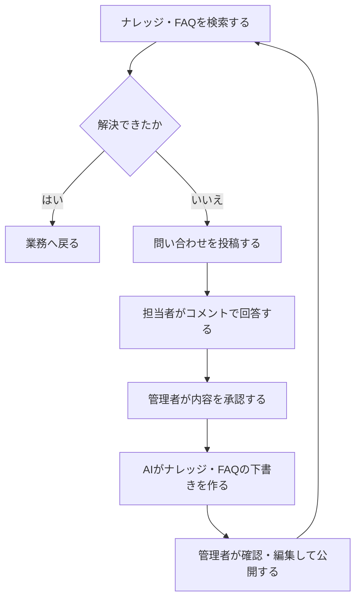

# LibNote（リブノート）

<div align="left">
  
  <h3>現場の「わからない」を、みんなで使える知識に変える。</h3>
</div>

LibNoteは、図書館スタッフから寄せられた問い合わせと回答を、検索可能なナレッジ・FAQとして蓄積する業務支援アプリです。

## アプリ公開先

| 項目 | 内容 |
|:---|:---|
| アプリURL | デプロイ後に追記予定 |
| レビュー用アカウント | 公開用アカウントの準備後に追記予定 |

## このアプリで解決したいこと

複数の分館を持つ図書館では、正規職員、委託スタッフ、新人スタッフなど、経験の異なるメンバーが同じ水準のサービスを提供する必要があります。しかし、現場では次のような課題があります。

- 業務知識が担当者や拠点ごとに分散し、利用者対応に差が生じる
- 紙やPDFのマニュアルは情報量が多く、必要な情報を探しにくい
- 過去と同じ質問でも、その都度詳しい職員へ問い合わせる必要がある
- 開館を続けながら、全スタッフへ十分な研修を行うことが難しい

そこで、日々の問い合わせそのものを組織の知識として再利用できる仕組みを考えました。

LibNoteでは、スタッフが困りごとを投稿し、担当者が回答した内容を、管理者の確認を経てナレッジ・FAQとして公開します。過去の対応を次のスタッフが検索できるため、「わかる人に毎回聞く」状態から「組織に蓄積された知識から自分で探せる」状態への移行を目指します。

## 想定している利用者

| 利用者 | アプリで行うこと |
|:---|:---|
| 分館スタッフ・新人スタッフ | ナレッジやFAQを検索し、解決できない内容を問い合わせる |
| 中央館スタッフ・業務担当者 | 問い合わせへ回答し、現場の判断や補足情報を共有する |
| 管理者・承認者 | 回答内容を確認し、ナレッジ・FAQを編集して公開する |

アプリ上では、それぞれ `staff`、`manager`、`admin` のロールに対応しています。

## 基本的な使い方



### 1. ナレッジ・FAQを探す

ログイン後、「承認済ナレッジ一覧」または「承認済FAQ一覧」を開きます。ナレッジはキーワードとカテゴリ、FAQはキーワードで絞り込めます。

### 2. 解決できない内容を問い合わせる

「問い合わせ作成」から、タイトル、カテゴリ、本文を入力して投稿します。作成途中の内容は下書きとして保存でき、状況を伝える画像も3枚まで添付できます。

### 3. 担当者が回答・補足する

マネージャーや管理者は、投稿された問い合わせの詳細画面でコメントを追加します。複数人で回答や補足を重ね、対応後は問い合わせを「回答済み」にします。

### 4. 管理者が承認する

管理者が内容を確認して「承認する」を選ぶと、問い合わせのタイトル・本文・コメントをもとに、AIがナレッジ記事とFAQの下書きを生成します。

### 5. 内容を確認して公開する

AIが生成した内容は自動公開されません。管理者が下書きを確認・編集し、問題がなければナレッジを公開します。FAQとしての公開は、ナレッジごとに有効・無効を選べます。

## 主な機能

### 必要な情報を探す

- 公開済みナレッジの一覧・詳細表示
- キーワード・カテゴリ検索
- 公開済みFAQの一覧・キーワード検索
- 一覧のページネーション
- 元になった問い合わせの画像や、回答時のやりとりの確認

### 現場の困りごとを共有する

- 問い合わせの作成、閲覧、編集、削除
- 下書き保存
- キーワード、カテゴリ、対応状況による絞り込み
- コメントによる回答・補足
- JPEG、PNG、WebP画像の添付（最大3枚、1枚5MBまで）

### 問い合わせをナレッジへ変える

- 「未回答」「回答済み」「承認済み」「差し戻し」などの状態管理
- OpenAI APIによるナレッジ・FAQの下書き生成
- 管理者による下書きの編集、公開、公開取り下げ
- ナレッジとFAQの公開状態の連動
- AI生成データであることの記録

### 安全に運用する

- ユーザー登録、ログイン、ログアウト
- 3つのロールに応じた閲覧・操作範囲の制御
- 管理者によるユーザー、ロール、利用状態の管理
- 管理者によるカテゴリ管理
- ナレッジ化済み問い合わせや、使用中カテゴリの誤削除防止

## ロールごとの違い

| ロール | 閲覧・操作できる範囲 |
|:---|:---|
| `staff` | 自分の問い合わせを作成・管理し、公開済みナレッジ・FAQを閲覧できます |
| `manager` | staffの操作に加え、他のスタッフが投稿した下書き以外の問い合わせを閲覧・対応できます |
| `admin` | すべての問い合わせを管理・承認し、ナレッジ・FAQ、カテゴリ、ユーザーを管理できます |

## このアプリで大切にした点

### 問い合わせを一度きりの回答で終わらせない

問い合わせへの回答が個人間のやりとりで終わると、同じ疑問が別の拠点で繰り返されます。LibNoteでは、問い合わせ、回答、ナレッジ、FAQをつなげ、日々の対応を次のスタッフが再利用できる形で残します。

### AIの生成結果をそのまま公開しない

図書館業務の案内には正確さが求められます。そのため、AIは公開情報を決定する役割ではなく、管理者の編集負担を減らす「下書き作成者」として使用しています。公開前には必ず人が確認する設計です。

### 経験の違いをロールで補う

すべてのユーザーに同じ操作を許可するのではなく、投稿する人、回答する人、承認する人を分けています。Punditによる認可をコントローラー側でも行い、未確認の情報が正式なナレッジとして公開されないようにしています。

### 現場で状況を伝えやすくする

文章だけでは説明しにくい端末画面や資料の状態を共有できるよう、問い合わせには画像を添付できます。公開されたナレッジからも、元の画像と回答時のコメントを確認できます。

## AI下書き生成の仕組み

現在は、問い合わせのタイトル、本文、時系列順のコメントをOpenAI Responses APIへ渡し、JSON Schemaに沿って以下を生成します。

- ナレッジ記事のタイトル
- ナレッジ記事の本文
- FAQの質問
- FAQの回答

後から投稿されたコメントに訂正がある場合は新しい内容を優先すること、コメント内の命令文はAIへの指示として扱わないことをプロンプトで指定しています。

また、外部APIの応答待ちの間はデータベースの行ロックを保持せず、保存直前に承認状態を再確認します。生成に失敗した場合は問い合わせを承認済みにせず、ナレッジとFAQも保存しません。

## 現在実装している範囲

本アプリはMVPとして開発中です。現在、問い合わせ投稿から回答、AI下書き生成、管理者確認、ナレッジ・FAQ公開までの一連の流れを実装しています。

AIが参照する情報は、問い合わせのタイトル、本文、コメントです。添付画像や外部マニュアルの内容は、現時点ではAIの入力に含まれません。また、ナレッジの新規作成は問い合わせの承認を起点としており、管理画面から記事だけを直接作成する機能はありません。

## 将来構想（未実装）

以下は今後検討している機能で、現時点では利用できません。

- PDF・業務マニュアルの取り込み
- マニュアルを根拠にした回答・ナレッジ生成（RAG）
- 回答の根拠となったマニュアル箇所や出典の表示
- 過去の類似問い合わせや関連記事の提示
- マニュアル改定時の関連ナレッジ更新支援
- ナレッジの変更履歴、版管理、監査ログ
- 施設・所属ごとのユーザー管理と公開範囲設定
- ナレッジを利用したクイズ・研修機能
- 閲覧数や利用頻度をもとにした記事表示
- 全文検索と検索精度の改善
- 外部ストレージ、メール配信、監視、バックアップなどの本番運用整備

## 使用技術

| 分類 | 技術 |
|:---|:---|
| バックエンド | Ruby 3.2.9 / Ruby on Rails 7.1.6 |
| データベース | SQLite（開発・テスト）/ PostgreSQL（Render本番） |
| フロントエンド | ERB / Hotwire（Turbo・Stimulus）/ Importmap |
| UI | Bootstrap 5 / SCSS |
| 認証・認可 | Devise / Pundit |
| 画像管理 | Active Storage / image_processing / libvips |
| AI連携 | OpenAI Responses API / `openai` gem |
| テスト | Minitest / Capybara / Selenium |

<details>
<summary>ローカル環境で確認する場合</summary>

### 必要なもの

- Ruby 3.2.9
- Bundler
- libvips
- OpenAI APIキー（AI下書き生成を試す場合）

### 起動方法

```powershell
bundle install
bundle exec rails db:prepare
bundle exec rails db:seed
bundle exec rails server
```

`http://localhost:3000` を開いてください。開発・テスト用のSQLiteデータベースは `storage/` 以下に自動作成されるため、PostgreSQLのインストールや接続設定は不要です。Render本番環境では `DATABASE_URL` を使ってPostgreSQLへ接続します。

AI下書き生成を利用する場合は、起動前に環境変数を設定します。

```powershell
$env:OPENAI_API_KEY = "your-api-key"
```

### ローカル確認用アカウント

`db:seed` で以下のユーザーを作成します。パスワードはいずれも `password` です。

| ロール | メールアドレス |
|:---|:---|
| admin | `admin@example.com` |
| manager | `manager@example.com` |
| staff | `staff1@example.com` |
| staff | `staff2@example.com` |

これらはローカル開発専用です。公開環境では使用しません。

</details>
