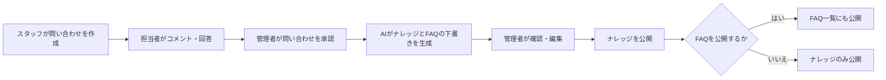
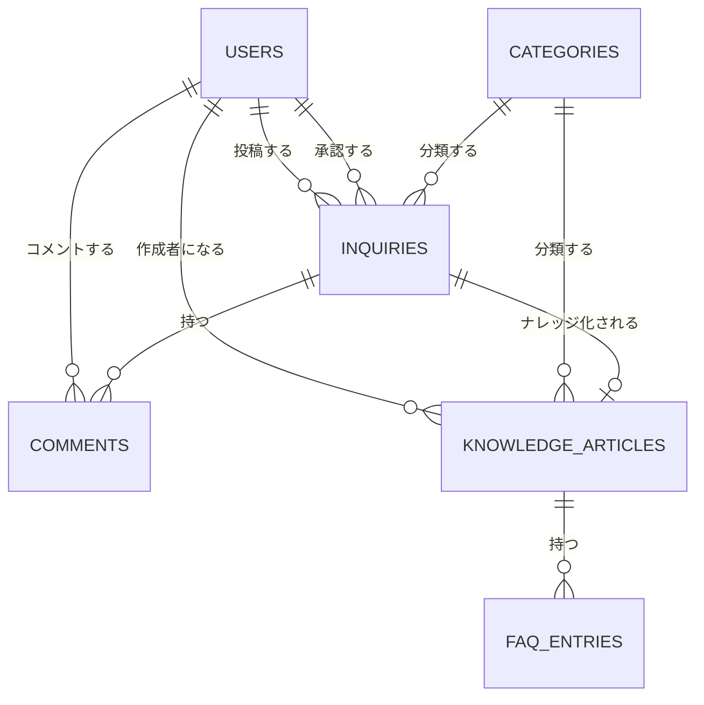

# LibNote（リブノート）

### 図書館スタッフのための業務ナレッジ共有アプリ

> 開発ステータス: MVP開発中（最終更新: 2026-08-07）
>
> このREADMEでは、現在コード上で確認できる機能と、未実装の将来構想を分けて記載しています。

## LibNoteとは

LibNoteは、図書館業務で生まれる問い合わせや回答を、組織で再利用できるナレッジとFAQへ育てるためのWebアプリケーションです。

スタッフが投稿した問い合わせに担当者がコメントし、管理者が内容を承認すると、OpenAI APIを利用してナレッジ記事とFAQの下書きを生成します。生成物はそのまま公開せず、管理者が内容を確認・編集したうえで公開します。

図書館を主な利用現場として想定していますが、複数拠点で業務知識を共有する組織にも応用できる構成を目指しています。

## 制作背景

複数の分館(拠点)を持つ図書館(施設)では、正規職員、委託スタッフ、新人スタッフなど、経験やITリテラシーの異なるメンバーが同じ水準のサービスを提供する必要があります。一方で、次のような課題が起こりがちです。

- 拠点や担当者によって、共有されている情報や利用者対応に差が生じる
- 紙やPDFのマニュアルが肥大化し、必要な情報をすぐに見つけにくい
- 同じ問い合わせが繰り返され、回答する側の負担が増える
- 開館(営業)を継続しながら全員の研修時間を確保することが難しい

LibNoteは、こうした現場課題のもとに、日々の問い合わせと回答を蓄積し、検索可能なナレッジとして再利用することで、情報格差の縮小と業務の標準化を支援します。

## 現在の利用フロー




現在のAI下書き生成では、問い合わせのタイトルと本文,
コメントを入力として使用します。添付画像、外部マニュアルはまだ生成時の参照対象ではありません。

## 実装済みの機能


### 認証・ユーザー管理

- Deviseによるユーザー登録、ログイン、ログアウト
- `staff`、`manager`、`admin` の3ロール
- 停止中または論理削除済みユーザーのログイン制限
- 管理者によるユーザー検索、情報・ロール・利用状態の変更
- 操作中の管理者自身と、最後の有効な管理者を保護する制御


### 問い合わせ管理

- 問い合わせの作成、閲覧、編集、削除
- 下書き保存と投稿済み状態の切り替え
- キーワード、カテゴリ、ステータスによる絞り込み
- 一覧のページネーション
- 画像添付とプレビュー
  - 1件につき最大3枚
  - 1枚あたり5MB以下
  - JPEG、PNG、WebPに対応
- ロール、所有者、ステータスに応じた閲覧・編集権限
- ナレッジ化済みの問い合わせを削除できない保護


### コメント・対応ステータス

- 問い合わせへのコメント投稿と履歴表示
- コメント投稿者または管理者によるコメント削除
- 問い合わせの「下書き」「未回答」「回答済み」「承認済み」「差し戻し」管理
- マネージャーによる未回答問い合わせの回答済み化・差し戻し
- 管理者による承認・差し戻し


### AIによる下書き生成

- 管理者が問い合わせを承認した際、OpenAI Responses APIを呼び出し
- 問い合わせのタイトル・本文から以下を構造化出力で生成
  - ナレッジ記事のタイトル・本文
  - FAQの質問・回答
- ナレッジ記事とFAQを下書きとして保存
- AI生成データであることをDB上に記録
- 二重承認を防ぐ再確認と、生成失敗時に承認状態を変更しない制御


### ナレッジ・FAQ

- 公開済みナレッジの一覧・詳細表示
- キーワード・カテゴリ検索とページネーション
- 管理者向け下書き一覧、編集、削除、公開、下書きへの差し戻し
- 元の問い合わせに添付された画像とコメントの参照
- ナレッジ公開状態とFAQ公開状態の同期
- FAQ公開の有効・無効設定
- 公開済みFAQの一覧、キーワード検索、ページネーション


### カテゴリ管理

- 管理者によるカテゴリの作成、編集、削除
- カテゴリ名検索と並び替え
- 問い合わせまたはナレッジで使用中のカテゴリを削除できない保護


### UI

- Bootstrapと独自SCSSによる、茶色・ベージュを基調としたデザイン
- 主要画面のレスポンシブ表示
- Turbo / Stimulus / Importmapを利用したRails標準構成


## ロールと主な権限


| ロール       | 想定ユーザー             | 主な権限                                        |
| --------- | ------------------ | ------------------------------------------- |
| `staff`   | 分館スタッフ、窓口担当、新人スタッフ | 自分の問い合わせの作成・閲覧・編集・削除、コメント、公開済みナレッジ・FAQの閲覧   |
| `manager` | 中央館スタッフ、業務担当者      | staffの権限に加え、他ユーザーの下書き以外の問い合わせ閲覧、未回答問い合わせの対応 |
| `admin`   | システム管理者、承認者        | 全問い合わせの管理・承認、ナレッジとFAQの編集・公開、カテゴリ・ユーザー管理     |


認可処理にはPunditを使用しています。画面上のリンク表示だけでなく、コントローラー側でも操作権限を検証します。

## 主なデータ構造




問い合わせ画像はActive Storageで管理します。実際のカラム、制約、関連は `db/schema.rb` と各モデルを参照してください。

## 技術スタック


| 分類       | 技術                                          |
| -------- | ------------------------------------------- |
| バックエンド   | Ruby 3.2.9 / Ruby on Rails 7.1.6            |
| データベース   | PostgreSQL                                  |
| フロントエンド  | ERB / Hotwire（Turbo・Stimulus）/ Importmap    |
| UI       | Bootstrap 5 / SCSS                          |
| 認証・認可    | Devise / Pundit                             |
| 画像管理     | Active Storage / image_processing / libvips |
| AI連携     | OpenAI Responses API / `openai` gem         |
| ページネーション | Kaminari                                    |
| テスト      | Minitest / Capybara / Selenium              |


## セットアップ


### 前提環境

- Ruby 3.2.9
- PostgreSQL
- Bundler
- libvips（添付画像のリサイズに使用）
- OpenAI APIキー（AI承認フローを使用する場合のみ）

`config/database.yml` の初期設定は、ローカルのPostgreSQLを次の接続情報で利用します。環境に合わせて変更してください


| 項目             | 初期値                   |
| -------------- | --------------------- |
| Host           | `localhost`           |
| Port           | `5432`                |
| User           | `postgres`            |
| Password       | `libnote`             |
| Development DB | `libnote_development` |
| Test DB        | `libnote_test`        |


### インストールと起動

```powershell
bundle install
bundle exec rails db:prepare
bundle exec rails db:seed
bundle exec rails server
```

ブラウザで `http://localhost:3000` を開きます。

### OpenAI APIの設定

管理者による問い合わせ承認では、APIキーが必要です。PowerShellの場合は、起動前に環境変数を設定します。

```powershell
$env:OPENAI_API_KEY = "your-api-key"

# 任意。未指定時はアプリ内の既定モデルを使用します。
$env:OPENAI_MODEL = "gpt-5.6-terra"
```

APIキーが未設定、またはAPI呼び出しに失敗した場合、AI下書きを必要とする承認処理は完了しません。APIキーをリポジトリへコミットしないでください。

### 開発用初期ユーザー

`db:seed` で以下のユーザーを作成します。パスワードはいずれも `password` です。


| ロール     | メールアドレス               |
| ------- | --------------------- |
| admin   | `admin@example.com`   |
| manager | `manager@example.com` |
| staff   | `staff1@example.com`  |
| staff   | `staff2@example.com`  |


これらはローカル開発用です。公開環境では使用しないでください。

## テスト

全テストは次のコマンドで実行できます。

```powershell
bundle exec rails test
```

個別のテストを実行する例:

```powershell
bundle exec rails test test/models/inquiry_test.rb
bundle exec rails test test/controllers/inquiries_controller_test.rb
```


## 現時点の制約

- AI下書きは問い合わせのタイトルと本文、コメントを参照し、画像、マニュアルは参照しません
- 問い合わせ承認とAI下書き生成が一体のため、OpenAI APIを利用できない状態での手動承認フローはありません
- ナレッジは問い合わせ承認からのみ作成され、管理画面からの手動新規作成には対応していません
- ナレッジの `archived` 状態はデータモデルにありますが、画面から状態を変更する操作は未実装です
- 添付ファイルは現在ローカルディスクへ保存します
- デプロイ先、外部ストレージ、メール配信などの本番運用設定は未整備です


## 将来構想（未実装）

以下は方向性として検討している項目であり、現時点では利用できません。

### マニュアル・RAG連携

- PDFや業務資料の取り込みと管理
- マニュアルを根拠にしたナレッジ下書き生成
- 回答やナレッジに関連するマニュアル箇所・出典の提示
- マニュアル改定時の差分確認と、関連ナレッジの更新支援


### AI支援の拡張

- 過去の類似問い合わせを踏まえた下書き生成
- 回答作成時の参考情報・回答案の提示
- AI生成内容の品質評価と、プロンプト・モデル管理
- API障害時の再実行や手動承認フロー


### ナレッジ運用

- 承認・変更履歴の保存と監査ログ
- ナレッジのアーカイブ操作と版管理
- 関連記事、閲覧数、よく使われる記事の表示
- 全文検索や検索精度の改善


### 組織・学習機能

- 図書館・分館などの施設管理とユーザー所属管理
- 施設ごとの情報公開範囲
- ナレッジを利用したクイズ・研修機能
- 学習状況の可視化


### 本番運用

- クラウド環境へのデプロイ
- S3互換ストレージなどへの添付ファイル保存
- メール配信、監視、バックアップ、CI/CDの整備

