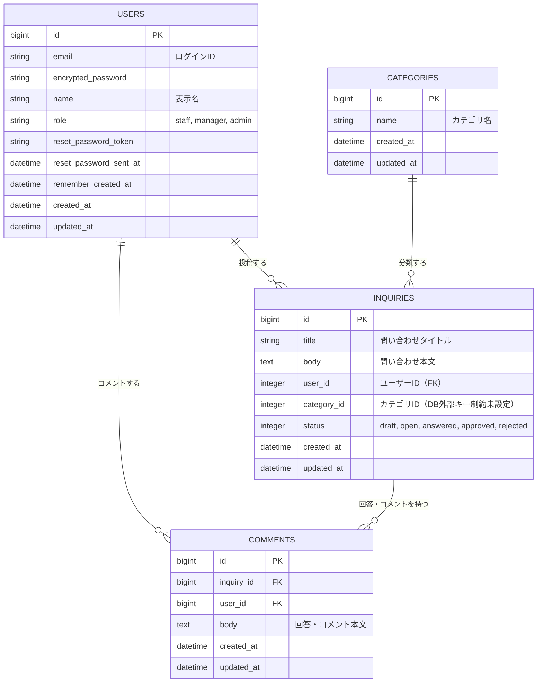
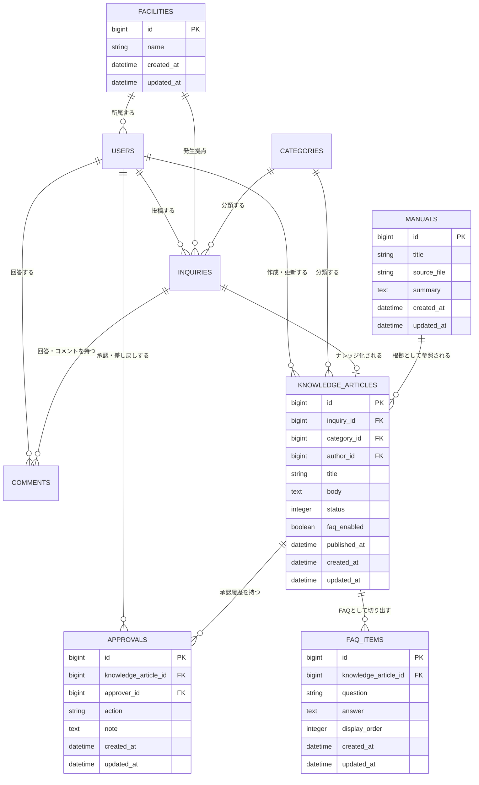

# LibNote ER図

このER図は、READMEに記載されている機能整理と、現在の `db/schema.rb` / Railsモデルから読み取れる実装状況をもとに作成しています。

## 現状のER図

現在の実装では、問い合わせ投稿、カテゴリ分類、ユーザー、コメントを中心に構成されています。

## テーブルの役割

| テーブル | 役割 | README上の対応機能 |
|:---|:---|:---|
| `users` | ログインユーザーと権限を管理する | ユーザー管理、権限管理 |
| `inquiries` | 業務上の疑問・問い合わせを管理する | 問い合わせ投稿、ステータス管理、承認ワークフロー |
| `comments` | 問い合わせに対する回答・補足を管理する | 回答・コメント機能、回答履歴 |
| `categories` | 問い合わせの業務分野を分類する | カテゴリ管理、カテゴリ検索 |

## ステータスと権限

`inquiries.status` はRails enumとして次の状態を持ちます。

| 値 | 状態 | 想定される意味 |
|:---|:---|:---|
| `draft` | 下書き | 未公開または作成途中 |
| `open` | 未回答 | 問い合わせ投稿済み |
| `answered` | 回答済み | 直営スタッフ・業務担当者が回答済み |
| `approved` | 承認済み | 管理者が正式情報として承認済み |
| `rejected` | 差し戻し | 修正・再確認が必要 |

`users.role` はRails enumとして次のロールを持ちます。

| 値 | README上のロール | 主な役割 |
|:---|:---|:---|
| `staff` | 委託スタッフ | 問い合わせを投稿し、ナレッジを参照する |
| `manager` | 直営スタッフ | 問い合わせへ回答し、差し戻しや回答済み化を行う |
| `admin` | 管理者 | 承認、差し戻し、ユーザー・カテゴリ管理を担う |

## READMEから見た拡張候補ER図

READMEでは、問い合わせと回答をもとにナレッジ記事やFAQを作成し、マニュアル連携や検索に広げていく構想が示されています。以下は、今後の機能追加時に検討できる概念ER図です。現時点の `db/schema.rb` には未実装のテーブルを含みます。

## 実装メモ

- `Inquiry` はモデル上 `belongs_to :user` / `belongs_to :category` です。
- 現在のDBスキーマでは `inquiries.user_id`/ `inquiries.category_id`ともに `users` への外部キー制約が追加済みです。
- READMEの「ナレッジ一覧表示」「ナレッジ詳細表示」「FAQ化」「マニュアル連携」をDBとして分離するなら、`knowledge_articles` を中心に、必要に応じて `faq_items`、`manuals`、`approvals` を追加する構成が自然です。
