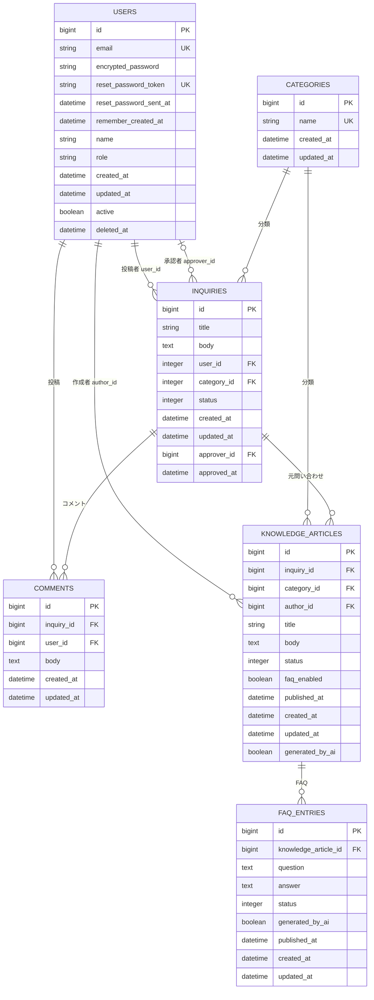
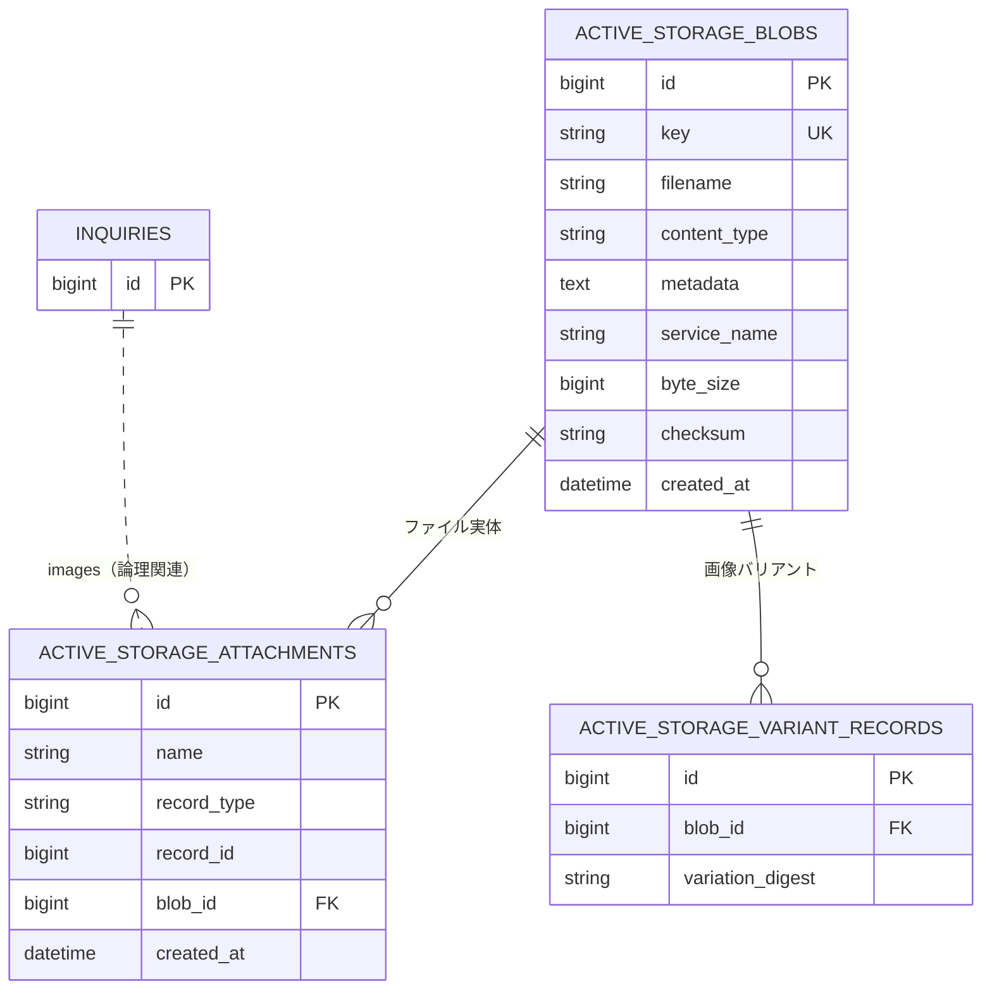

# LibNote ER図

## 1. 文書情報

| 項目 | 内容 |
|:---|:---|
| 対象 | LibNote 現行データベース |
| 基準スキーマ | `db/schema.rb` |
| スキーマバージョン | `2026_08_01_073923` |
| 作成日 | 2026-08-07 |

実線はDB外部キー、点線はアプリケーション上のポリモーフィック関連を表します。カーディナリティはDB制約を基準にしています。

## 2. 業務テーブル

```mermaid
erDiagram
    USERS ||--o{ INQUIRIES : "投稿者 user_id"
    USERS o|--o{ INQUIRIES : "承認者 approver_id"
    CATEGORIES ||--o{ INQUIRIES : "分類"
    USERS ||--o{ COMMENTS : "投稿"
    INQUIRIES ||--o{ COMMENTS : "コメント"
    USERS ||--o{ KNOWLEDGE_ARTICLES : "作成者 author_id"
    CATEGORIES ||--o{ KNOWLEDGE_ARTICLES : "分類"
    INQUIRIES ||--o{ KNOWLEDGE_ARTICLES : "元問い合わせ"
    KNOWLEDGE_ARTICLES ||--o{ FAQ_ENTRIES : "FAQ"

    USERS {
        bigint id PK
        string email UK
        string encrypted_password
        string reset_password_token UK
        datetime reset_password_sent_at
        datetime remember_created_at
        string name
        string role
        datetime created_at
        datetime updated_at
        boolean active
        datetime deleted_at
    }

    CATEGORIES {
        bigint id PK
        string name UK
        datetime created_at
        datetime updated_at
    }

    INQUIRIES {
        bigint id PK
        string title
        text body
        integer user_id FK
        integer category_id FK
        integer status
        datetime created_at
        datetime updated_at
        bigint approver_id FK
        datetime approved_at
    }

    COMMENTS {
        bigint id PK
        bigint inquiry_id FK
        bigint user_id FK
        text body
        datetime created_at
        datetime updated_at
    }

    KNOWLEDGE_ARTICLES {
        bigint id PK
        bigint inquiry_id FK
        bigint category_id FK
        bigint author_id FK
        string title
        text body
        integer status
        boolean faq_enabled
        datetime published_at
        datetime created_at
        datetime updated_at
        boolean generated_by_ai
    }

    FAQ_ENTRIES {
        bigint id PK
        bigint knowledge_article_id FK
        text question
        text answer
        integer status
        boolean generated_by_ai
        datetime published_at
        datetime created_at
        datetime updated_at
    }
```

### カーディナリティ補足

- 1件の問い合わせには投稿者が必ず1人、承認者は0または1人紐づきます。
- 1件の問い合わせは複数のコメントを持てます。
- `Inquiry` モデルはナレッジ記事を0または1件と想定していますが、DBに一意制約がないため、物理ER図では1対多として表しています。
- 1件のナレッジ記事は複数のFAQを持てます。

## 3. Active Storage

```mermaid
erDiagram
    INQUIRIES ||..o{ ACTIVE_STORAGE_ATTACHMENTS : "images（論理関連）"
    ACTIVE_STORAGE_BLOBS ||--o{ ACTIVE_STORAGE_ATTACHMENTS : "ファイル実体"
    ACTIVE_STORAGE_BLOBS ||--o{ ACTIVE_STORAGE_VARIANT_RECORDS : "画像バリアント"

    INQUIRIES {
        bigint id PK
    }

    ACTIVE_STORAGE_ATTACHMENTS {
        bigint id PK
        string name
        string record_type
        bigint record_id
        bigint blob_id FK
        datetime created_at
    }

    ACTIVE_STORAGE_BLOBS {
        bigint id PK
        string key UK
        string filename
        string content_type
        text metadata
        string service_name
        bigint byte_size
        string checksum
        datetime created_at
    }

    ACTIVE_STORAGE_VARIANT_RECORDS {
        bigint id PK
        bigint blob_id FK
        string variation_digest
    }
```

`Inquiry#images` は `active_storage_attachments` の `record_type = 'Inquiry'`、`name = 'images'` として紐づきます。`record_type` / `record_id` はポリモーフィック関連で、`inquiries` へのDB外部キーはありません。

複合一意インデックスは次の2つです。

- `active_storage_attachments(record_type, record_id, name, blob_id)`
- `active_storage_variant_records(blob_id, variation_digest)`

## 4. 状態値

| 列 | enum値 |
|:---|:---|
| `users.role` | `staff`, `manager`, `admin` |
| `inquiries.status` | `0: draft`, `1: open`, `2: answered`, `3: approved`, `4: rejected` |
| `knowledge_articles.status` | `0: draft`, `1: published`, `2: archived` |
| `faq_entries.status` | `0: draft`, `1: published`, `2: archived` |

詳細な列定義、インデックス、外部キーは [テーブル定義書](./table_definitions.md) を参照してください。
